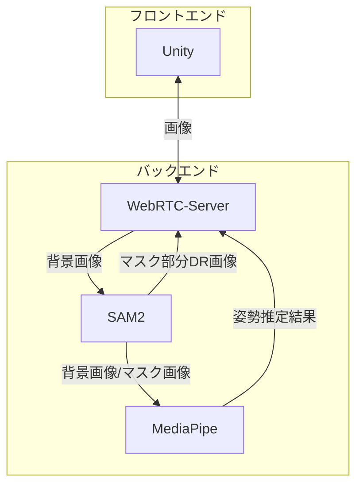

# Persona

[](https://www.youtube.com/watch?v=DZXUkEj-CSI)

## 製品概要

### 背景 (製品開発のきっかけ、課題等)

昨今、オンラインでのコミュニケーション手段は、単なる文字ベースのチャットだけではなく、音声通話やビデオ通話など多岐にわたっている。その中でも、アバターによってコミュニケーションを行うVRChatやClusterなどの**バーチャルSNS**が広く用いられるようになってきている。  
バーチャルSNSでは、アバターという自分の分身のようなキャラクターを用いてコミュニケーションを取ることが特徴である。その手軽さや、自分のなりたい姿になってコミュニケーションできることから、近年急速に利用者を増やしている。  
だたし、現状ではアバターの姿を見るためには、スマートフォンやヘッドマウントディスプレイ（HMD）越しで映像を閲覧する必要がある。  
そのため屋外では、スマートフォンかざしたり、HMDを装着する必要がある。  
スマートフォンでやる方法が最も簡単で扱いやすいが、映し出せる視界が限られていることや、その方向に向ける必要があること、長時間の仕様になると腕がつかれるなどの問題がある。  
また、HMDも現状のものは大きく・重く・稼働時間が短いため屋外での装着は難しいが、技術革新が進めば、[Metaが先日発表したARグラス](https://about.fb.com/ja/news/2024/09/orion-ar-glasses-augmented-reality)のように小型化・軽量化していくだろう。  
そうなると、今のスマートフォンのように皆が身につけ、持ち運び、活用していく未来が訪れる。  
そのような社会において、[自己アバターにはアイデンティティが伴うことが研究結果で示されているため](https://youtu.be/rya1SeMBkxY?si=YZT4k3EongY9GBV6&t=186)、自己のアバターは単なるオンライン上の姿だけではなく、現実世界の姿形にも反映させていくべきではないかと考え、このプロダクトを開発した。  

### 製品説明 (具体的な製品の説明)

### 特長

#### 1. 特長1

#### 2. 特長2

ただ単に人の上にアバターを重ねるのではなくDiminished Reality、日本語では隠消現実と呼ばれる技術を使用してアバターに置き換えられる人を消去することで、違和感なくアバターのみを映す事ができる。  

#### 3. 特長3

### 解決出来ること

* 現実世界でも自分のアイデンティティを失わずに人と会い、コミュニケーションすることが出来る。  
* 現実世界ではできないような、新たな形の自己実現を達成できる。  

### 今後の展望

* Meta Quest 3やApple Vision Proのような実際のHMDでも動作させる
* バックエンドの処理が重いため、処理の高速化
* 人だけではなく、例えば案内ロボットを自分の好きなキャラクターに置き換えることも出来る

### 注力したこと (こだわり等)

## 開発技術

### 活用した技術

#### API・データ

[ユニティちゃん](https://unity-chan.com)
©Unity Technologies Japan/UCL

#### アーキテクチャ



### ディレクトリ構造

```txt
/os_2411
    /frontend ... Unity
        /Assets
        ...
    README.md

    /backned  ... Python
        /server ... WebRTC
        /instance-segmentation ... SAM2
        /pose-estimation ... MediaPipe
        /diminished-reality ... OpenCV
    pyproject.toml
    .python-version
    README.md

LICENSE
README.md
```

#### フレームワーク・ライブラリ・モジュール

##### Frontend

| 役割 | 名前 |
| - | - |
| アバター制御 | Unity |
| リアルタイム通信 | WebRTC for Unity |

##### Backend

| 役割 | 名前 |
| - | - |
| コンピュータビジョンライブラリ| OpenCV |
| リアルタイム通信 | aiohttp, aiortc |
| 人物検出 | Segment Anything Model 2 |
| 姿勢推定 | MediaPipe |

#### デバイス

* Android

### 独自技術

#### ハッカソンで開発した独自機能・技術

* 独自で開発したものの内容をこちらに記載してください
* 特に力を入れた部分をファイルリンク、またはcommit_idを記載してください。
