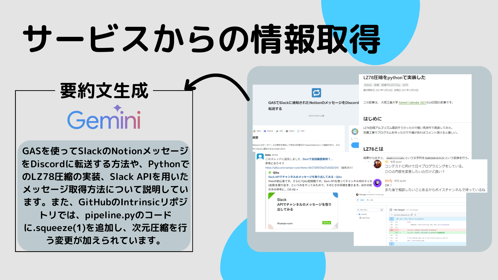
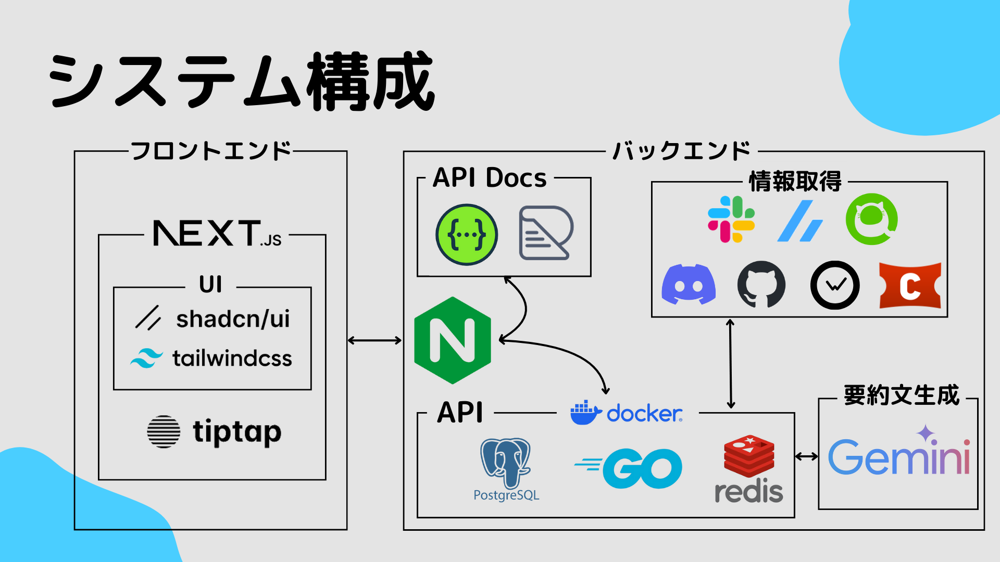

# <ruby>Chronotes<rp>(</rp><rt>クロノート</rt><rp>)</rp></ruby>

[](https://www.youtube.com/watch?v=JpJH_WVD53E)

## 製品概要

### 背景 (製品開発のきっかけ、課題等)


日記や日報と言った毎日の記録をつける作業って、面倒くさいと感じたことはありませんか？  
また、せっかくつけた記録を振り返ることなく、活用できずにいませんか？  
私達はそのような課題を解決したいと考え、「Chronotes」を開発しました。  

### 製品説明 (具体的な製品の説明)


ChronotesはAI駆動のノート生成を行うアプリケーションです。  
ユーザーはあらかじめアカウントを連携しておくだけで、AIが毎日の作業ログを自動で収集し、簡潔にまとめて「ノート」に書き出します。  
ユーザーはこのノートを見るだけで、毎日の作業内容を把握でき、振り返ることができます。  
作業ログはGitHub, Discord, Slack, Qiitaなどの複数のサービスから毎日自動で収集します。  
現在は開発者向けサービスとして開発しているため、開発者向けのサービス連携が多いです。  
また、毎日生成されるノートだけではなく、週や月ごとに作業内容をまとめたノートも生成します。  
これにより、この週はooをやった、この月はxxをやった、のように大局的な視点で振り返ることができます。  

### 特長

#### 1. 特長1


Chronotesでは、カレンダーを使用して日々の進捗を可視化することができます。  
表示されているカレンダーは、メモに記録された文字数に基づいて日付の色が変化する仕組みを取り入れています。  
文字数が多い日ほど色が濃く、少ない日ほど色が薄くなります。  
この色の変化により、メモの量、つまりその日の活動や記録の充実度を直感的に把握することが可能です。  
例えば、カレンダー上で色が濃い日付は、その日に多くのメモが残されていることを示しており、逆に色が薄い日付はあまり書き込みがなかったことを意味します。  
この視覚的な進捗の表現は、ユーザーが自身の活動のペースや取り組みの度合いを一目で確認するのに役立ちます。  

#### 2. 特長2



Chronotesでは、ノートの自動生成のために各サービスとの連携を行っています。  
この例では、SlackとDiscordからは会話内容、ZennやQiitaからは記事のタイトル、GitHubからはコミットメッセージと変更内容を収集しています。  
これらの収集されたデータはGeminiによって要約され、ノートとして出力されます。

#### 3. 特長3


生成された要約文からタイトルとタグを自動生成します。
今回の文章からは、タイトルは「SlackとDiscordの連携」、タグは「Intrinsic」「GAS」「LZ78」が生成され、計3つのタグが生成されます。

#### 4. 特長4


Chronotesでは日々の記録の可視化にも力を入れており、ノートのタグからワードと頻度を元にWordCloudを生成します。  
これは頻度が高いワードほど大きく表示されるもので、サマリーページに表示することにより、ユーザーは特定の期間の内容を人目で把握することができます。  

### 解決出来ること


Chronotesは、開発者やチームリーダー、自己管理を重視する人々のためのアプリケーションです。
AIが毎日の作業ログを自動で収集し、簡潔なノートを生成します。
これにより、日報を書く手間が省け、重要な業務に集中できるようになり、四半期や半期の評価作業もスムーズに行え、作業効率が向上します。  

### 注力したこと (こだわり等)

* スマホ/PC問わず使えるようなUI
* AIによるノートの自動生成
* ノートの内容に即したタイトルやタグの自動生成
* ノートをまとめる機能による大局的な視点での振り返り
* WordCloudによる日々の記録の可視化
* GitHub ActionsによるCI/CD

## 開発技術



### 活用した技術


* Gemini

#### API・データ

<div style="display: flex; align-items: center;">
    
    
    
    
    
    
    
</div>

* GitHub
* GitLab
* Slack
* Discord
* Wakatime
* Zenn
* Qiita
* Connpass

#### フレームワーク・ライブラリ・モジュール


* Next.js
* TipTap
* Go
* Docker
* Docker Compose
* GitHub Actions

### 独自技術

#### ハッカソンで開発した独自機能・技術

* 独自で開発したものの内容をこちらに記載してください
* 特に力を入れた部分をファイルリンク、またはcommit_idを記載してください。

<!-- 
submodule更新
```sh
git submodule update --init --recursive
```
-->
